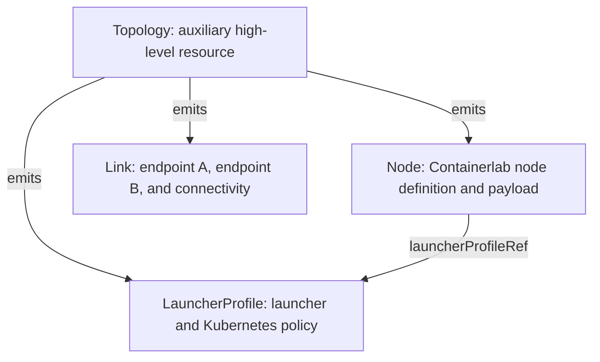
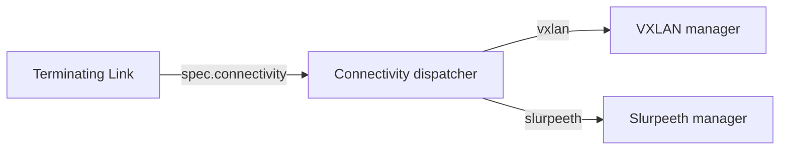

## Context

The existing Topology API stores the complete lab definition and deployment policy in one object. Its size grows with node count, link count, inline startup configuration, and other per-node data. Kubernetes and etcd impose a finite object payload limit, so the aggregate representation places a hard ceiling on labs even when every individual node and link is small.

The new API separates durable intent into bounded resources:



Node and Link are the authoritative resources. Topology remains an auxiliary high-level abstraction for quickly defining a lab, but users of large labs can generate or create Node and Link resources directly without persisting the entire source topology in one CR.

This change is being made in a `v1alpha1` API, so correcting resource boundaries takes precedence over preserving the experimental selector-based NodeProfile contract.

## Goals / Non-Goals

**Goals:**

- Keep every authoritative object bounded by one node, one link, or one reusable launcher profile.
- Allow Nodes and Links to be created, updated, deleted, and reconciled independently.
- Keep Node focused on Containerlab node intent and per-node payload without embedding Kubernetes resource or scheduling values.
- Make launcher policy attachment explicit, singular, namespace-local, and observable.
- Give each Link one authoritative connectivity flavor consumed by both endpoints.
- Preserve Topology as an auxiliary high-level resource that deterministically emits the primitive API.
- Keep allocations and observations in the status of the resource to which they belong.
- Limit controller and launcher watches to the resources that can affect the relevant node or link where practical.

**Non-Goals:**

- Defining the ownership or representation of shared Containerlab management-network settings.
- Claiming unlimited runtime scale; this design removes the single-object payload ceiling but controller throughput, API-server capacity, and total object count remain finite.
- Supporting cross-namespace Node, Link, or LauncherProfile references.
- Supporting multiple LauncherProfiles, selector-based policy overlays, profile priorities, or profile inheritance.
- Providing transparent conversion from every existing NodeProfile manifest.

## Decisions

### 1. Node and Link are the authoritative API

A Node represents one Containerlab network node. Its object name is the Containerlab node name and all soft references use that name within the same namespace. Its spec contains a flattened, self-contained Containerlab node definition plus Clabernetes per-node payload fields. Topology defaults and kinds are expanded before a Node is emitted.

A Link represents one point-to-point wire. It contains two Node-name/interface endpoints and link-local options. The Link controller validates endpoint existence and interface conflicts and records allocations or errors in Link status.

Topology is retained as an auxiliary high-level resource and owner of generated resources, not as a prerequisite for reconciliation. Its controller compiles the high-level definition, while Node and Link controllers treat generated and directly authored resources identically.

**Alternative considered:** Keep Topology authoritative and shard only status. This leaves the growing definition in one object and therefore does not remove the payload ceiling.

### 2. Node references one optional LauncherProfile explicitly

Node gains:

```yaml
spec:
  launcherProfileRef:
    name: standard
```

The reference is represented as an optional local object reference and is excluded from Containerlab YAML rendering. A fixed resource type and same-namespace lookup avoid unnecessary `apiGroup`, `kind`, and `namespace` fields.

Resolution rules are:

1. Global Config supplies the base defaults.
2. If `launcherProfileRef` is absent, those defaults are the effective launcher configuration.
3. If the reference is present, fields set by that one LauncherProfile override Config defaults.
4. If the referenced profile does not exist, the controller does not create or update the launcher workload and sets a `LauncherProfileResolved=False` Node condition.

The controller records the applied profile name, UID, and generation in Node status. A profile update enqueues only Nodes indexed as referencing that profile. Config updates still affect every Node using Config as a base.

**Alternative considered:** Select profiles with Node labels and merge all matches by priority. This supports implicit fleet policy, but makes a Node's realization depend on namespace-wide selector evaluation, permits accidental overlap, needs complex unset/merge semantics, and creates broad reconciliation fan-out.

**Alternative considered:** Keep selectors as overlays in addition to the explicit reference. This would retain two attachment models and an additional precedence layer, undermining the desired clear API boundary.

### 3. Rename NodeProfile to LauncherProfile and constrain its scope

LauncherProfile contains only Kubernetes and launcher realization policy:

- launcher Pod resource requirements and scheduling;
- privilege/security and persistence;
- launcher image, pull policy, version, timeout, logging, and environment;
- node-image pull-through and registry integration;
- Kubernetes exposure behavior; and
- operational probe behavior.

It does not contain Node selection, priority, or connectivity. It temporarily retains the existing shared management-network field solely so auxiliary Topology resources preserve their released behavior; the field's final owner is deferred. Omitted fields inherit Config defaults. Overrideable collection and scalar fields must preserve the distinction between unset and explicitly empty/false values.

Per-node payload attachments, including URL and ConfigMap-backed files needed to instantiate the network node, belong to Node rather than requiring one-off LauncherProfiles.

**Alternative considered:** Keep the NodeProfile name. That name is ambiguous between a template for the network device and policy for the outer launcher; LauncherProfile states the owned boundary directly.

### 4. Link owns connectivity

Each Link carries its connectivity flavor, defaulting to `vxlan` when omitted. Supported values initially include `vxlan` and `slurpeeth`. Both launchers terminating a cross-pod Link consume this one value, eliminating endpoint profile disagreement.

Host links and links whose endpoints share a launcher do not require a tunnel; connectivity is harmless when omitted and no tunnel allocation is produced. For cross-launcher links, the Link controller allocates the shared tunnel/segment identifier in status.

Launchers must handle the connectivity flavor per Link rather than from one launcher-wide environment value. This permits links terminating on one launcher to use different supported flavors and makes a connectivity update reconcile both endpoints.

The launcher uses a connectivity dispatcher that owns one implementation per supported flavor and partitions terminating Links between them:



The dispatcher remembers each local interface's current flavor. When a Link changes flavor, it first reconciles both managers without that interface to remove the old realization, then applies the complete desired state to create the replacement. This ordered transition prevents both tunnel implementations from owning the same local interface simultaneously.

**Alternative considered:** Keep connectivity on LauncherProfile. Two endpoints can reference different profiles, leaving no single owner for resolving disagreement.

#### Link endpoint lifecycle

The Link controller watches Node events and records the UID of each non-host endpoint after all endpoint Nodes resolve. Those observed UIDs distinguish a Link that is intentionally waiting for initially absent Nodes from a Link whose previously resolved endpoint was removed.

If a resolved endpoint disappears or its name resolves to a different UID, the controller deletes the Link. Reusing a Node name therefore does not silently reconnect an old wire to a different Node identity. Links that have never resolved all endpoints remain in an unresolved state and can become valid when their Nodes are created, preserving order-independent manifest application.

Node delete handlers log the deleted Node identity and the number of referenced Links scheduled for cleanup. Link reconciliation logs each deleted Link together with the endpoint side, Node name, and whether the bound identity was deleted or replaced. Repeated NotFound reconciles caused by dependent Kubernetes object deletion are debug-level noise rather than lifecycle events.

### 5. Grouped Nodes share one effective LauncherProfile

Containerlab nodes using `network-mode: container:<primary>` share the primary Node's launcher Pod. The primary's LauncherProfile is authoritative for the group. A secondary Node may omit the reference or reference the same profile; a conflicting reference is reported as invalid and prevents realization of the inconsistent group.

This avoids pretending that different Pod resources, scheduling, security, or persistence can apply independently to containers sharing one launcher Pod.

### 6. Status remains resource-local and bounded

Node status contains readiness, probe observations, exposed-port allocations, standard conditions, and the identity/version of the applied LauncherProfile. Link status contains tunnel allocation and standard conditions or a structured realization error.

Topology status contains only aggregate counts and conditions. It must not copy all child statuses or rendered manifests.

### 7. The auxiliary Topology resource emits deterministic primitives

The compiler expands source defaults and kinds into every Node, emits deterministic Link names, creates the required LauncherProfiles, and stamps each Node with its explicit profile reference. Shared topology launcher policy normally produces one shared profile. A per-node launcher override produces a complete dedicated profile for that Node rather than an inheritance chain.

Generated objects carry controller ownership and stable labels for pruning and observability. Profiles and Links are reconciled before Nodes so references and wiring exist when Node realization begins; Node conditions still handle transient absence safely.

Direct-manifest generation uses the same compile and render functions as in-cluster Topology compilation, excluding owner references.

## Risks / Trade-offs

- **More Kubernetes objects per lab** → Keep each object small, use deterministic names, use field indexes/selectors, and avoid broad child status aggregation.
- **A shared LauncherProfile update can roll many launcher Pods** → Document the blast radius, index references so only affected Nodes enqueue, and expose applied profile generation in status.
- **Removing selector overlays reduces operator-imposed policy features** → Use global Config for platform defaults and Kubernetes admission/policy mechanisms for mandatory organizational constraints.
- **Per-node Topology overrides can create many LauncherProfiles** → Emit dedicated profiles only for Nodes with distinct launcher policy and keep each profile bounded.
- **Mixed connectivity types require launcher refactoring** → Resolve and reconcile tunnel managers from each Link rather than a launcher-global setting, with tests covering mixed types and live changes.
- **Soft endpoint references can be temporarily unresolved** → Report conditions/errors and reconcile when referenced Nodes appear; do not create partial tunnels.
- **The optional Topology source can still exceed the payload limit** → Document that large labs must use direct/generated primitive manifests rather than persisting the source topology CR.
- **Shared management-network configuration has no new owner yet** → Retain the existing LauncherProfile field as a compatibility bridge for Topology-generated profiles and address its final ownership in a separate design.

## Migration Plan

1. Install Node, Link, and LauncherProfile CRDs and grant manager/launcher RBAC before enabling the new controllers.
2. Run Node and Link controllers alongside the Topology compiler so existing Topology resources can emit and own primitive resources.
3. Update the compiler and clabverter to create LauncherProfiles first, Links second, and Nodes with explicit references last.
4. Migrate NodeProfile manifests by creating equivalent LauncherProfiles and adding `launcherProfileRef` to the intended Nodes; selectors and priority are removed, connectivity moves to Links, and management settings remain temporarily available for compatibility.
5. Move topology/profile connectivity values onto emitted Links, defaulting omitted values to `vxlan`.
6. Regenerate clients, OpenAPI, UI types, examples, documentation, and tests, then remove the obsolete NodeProfile and legacy connectivity APIs after generated resources are healthy.

Rollback is straightforward for Topology-owned labs while the original Topology remains the source: stop the new controllers and restore the previous controller/CRD version. Directly authored Node/Link labs have no lossless automatic downgrade to one Topology object; users must retain their source Containerlab definition or generated manifests before rollback.

## Open Questions

- What resource, if any, should own non-default shared Containerlab management-network settings?
- Should profile identity/version be represented only through standard Node conditions or also through a dedicated `status.appliedLauncherProfile` object? This design assumes the dedicated status object for observability.
