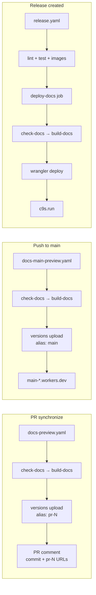
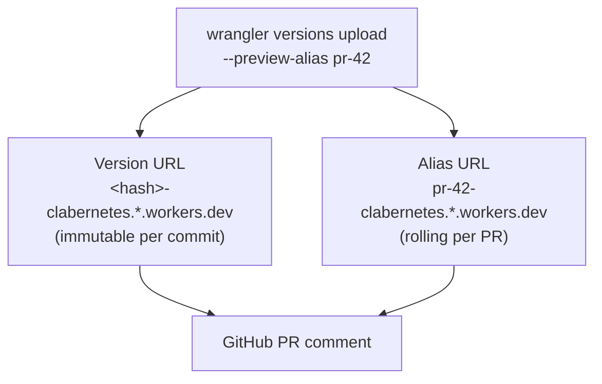
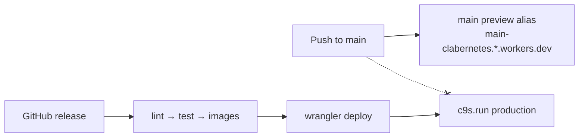
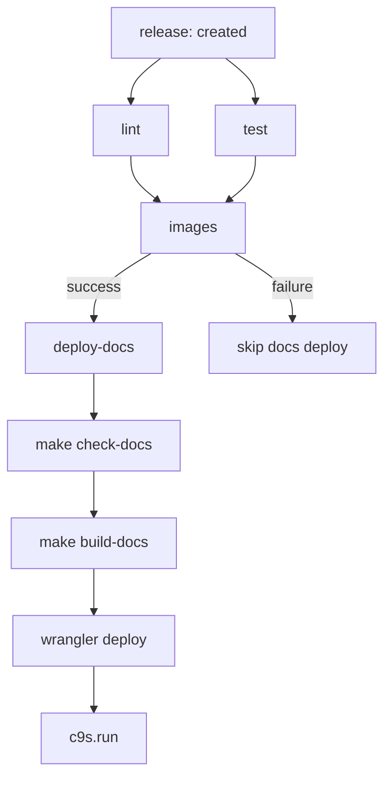
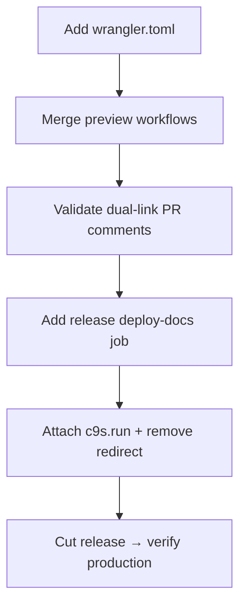

## Context

The repository already ships a Fumadocs-based documentation application under `docs-site/` with repository-owned Markdown in `docs/`. The site prerenders to static assets in `docs-site/build/client`, supports local development via `make serve-docs`, and validates links through `make check-docs`. Public traffic to `c9s.run` currently redirects to containerlab.dev documentation.

This change introduces hosted deployment on Cloudflare Workers Static Assets with GitHub Actions orchestration. A Worker named `clabernetes` already exists in the Cloudflare account and will be configured via repository-owned `wrangler.toml` to serve the documentation static assets. GitHub repository secrets `CLOUDFLARE_API_TOKEN` and `CLOUDFLARE_ACCOUNT_ID` are already configured for Wrangler authentication in workflows. Documentation previews must be fast and independent from the Go CI pipeline. Production must publish only after a release's code validation and image build succeed.

## Prerequisites

The following are already in place before implementation:

| Item | Status |
| ------ | -------- |
| Cloudflare Worker `clabernetes` | Created |
| GitHub secret `CLOUDFLARE_API_TOKEN` | Configured |
| GitHub secret `CLOUDFLARE_ACCOUNT_ID` | Configured |

## Goals / Non-Goals

**Goals:**

- Serve production documentation at `c9s.run` from the prerendered static build.
- On pull-request commits, run documentation validation and build in a standalone workflow, deploy previews to Cloudflare, and comment with both commit-specific and `pr-<number>` rolling preview URLs.
- On pushes to `main`, deploy a rolling `main` preview alias without updating production.
- Deploy production documentation from the release workflow only after lint, test, and image build jobs succeed.
- Authenticate Wrangler from GitHub Actions using the repository secrets `CLOUDFLARE_API_TOKEN` and `CLOUDFLARE_ACCOUNT_ID`.
- Reuse existing documentation targets (`make check-docs`, `make build-docs`).
- Keep deployment configuration in the repository (`wrangler.toml`, GitHub Actions).

**Non-Goals:**

- Migrating or rewriting documentation content.
- Hosting the operator UI or any Clabernetes runtime components on Cloudflare.
- Versioned documentation sets per release (single production site at latest release).
- Custom-domain preview URLs (previews use `workers.dev` preview URLs).
- Cloudflare Pages as the hosting product.
- Blocking documentation previews on Go lint/test completion.
- Automatic production deploy on merge to `main`.

## Decisions

### 1. Use Cloudflare Workers Static Assets, not Cloudflare Pages

**Decision:** Deploy the prerendered documentation to the existing Workers Static Assets project named `clabernetes`.

**Rationale:** The documentation output is fully static. Workers Static Assets serves it without custom Worker code, supports both versioned commit previews and aliased branch previews via `wrangler versions upload`, and fits release-gated production deploys.

### 2. Three independent deployment workflows

**Decision:** Split documentation deployment into three workflow entry points with different gating rules.



**Rationale:** Pull-request and `main` previews should not wait on unrelated Go CI. Production release deploy must wait for code validation and image build to avoid publishing docs for a broken release.

### 3. Pull-request preview URLs: commit snapshot + `pr-<number>` rolling alias

**Decision:** Each pull-request deployment uploads one Worker version and exposes two URLs in the PR comment:

1. **Commit preview URL** — the versioned preview URL returned by `wrangler versions upload` for that specific upload (immutable snapshot of the built commit).
2. **PR preview URL** — an aliased preview URL via `--preview-alias pr-<PR_NUMBER>` (rolling; updated on each new commit to the same pull request).

**Example PR comment:**

```markdown
## Documentation preview

| | URL |
|---|---|
| Commit `abc1234` | https://<version-prefix>-clabernetes.<account>.workers.dev |
| PR #42 | https://pr-42-clabernetes.<account>.workers.dev |
```

**Rationale:** Commit links are shareable for code review at a specific point in time. `pr-<number>` aliases are stable per pull request, DNS-safe, and unambiguous regardless of branch renames.

**Implementation note:** A single `wrangler versions upload` returns the versioned URL; pass `--preview-alias pr-<PR_NUMBER>` on the same upload to also update the PR rolling alias.



### 4. Main-branch rolling preview, not production

**Decision:** On `push` to `main`, run the standalone docs workflow and deploy with `--preview-alias main`, producing a stable URL such as `main-clabernetes.<account>.workers.dev`.

**Rationale:** `main` should always have a live docs preview for contributors, but production at `c9s.run` remains release-gated.



### 5. Release production deploy waits on code CI and image build

**Decision:** Add a `deploy-docs` job to `release.yaml` with:

```yaml
needs: [lint, test, images]
```

The job runs `make check-docs`, `make build-docs`, then `wrangler deploy` to production.

**Rationale:** Ensures documentation is not published to `c9s.run` when the release's code validation or image build has failed.



**Alternatives considered:**

- Deploy docs in parallel with images — rejected; user wants docs only after build succeeds.
- Wait for the full `release` job (goreleaser, helm) — broader than required; image build is the critical gate.

### 6. Documentation validation before every deploy

**Decision:** Run `make check-docs` before `make build-docs` in all preview and production deploy workflows.

**Rationale:** `check-docs` covers typecheck and link validation. Failing fast avoids uploading broken documentation.

### 7. Asset-only Worker configuration

**Decision:** Use a minimal `wrangler.toml` with `[assets].directory = "./docs-site/build/client"` and `preview_urls = true`. No custom Worker script unless routing issues appear.

### 8. Secrets and permissions

**Decision:** Workflows reference the GitHub repository secrets `CLOUDFLARE_API_TOKEN` and `CLOUDFLARE_ACCOUNT_ID` (already configured in the `clabernetes` repository). The API token must have Workers Scripts Edit permission.

**Workflow environment mapping:**

```yaml
env:
  CLOUDFLARE_API_TOKEN: ${{ secrets.CLOUDFLARE_API_TOKEN }}
  CLOUDFLARE_ACCOUNT_ID: ${{ secrets.CLOUDFLARE_ACCOUNT_ID }}
```

**GitHub permissions:**

- Preview workflow: `pull-requests: write` for comments, `contents: read`.
- Main preview workflow: `contents: read`.
- Release deploy job: existing release permissions plus secrets access.

## Risks / Trade-offs

| Risk | Mitigation |
| ------ | ------------ |
| Accidental production deploy on `main` push | `main` uses preview alias only; production deploy only in `release.yaml` |
| PR alias collisions | Use `pr-<number>` which is unique per pull request |
| Fork PRs cannot use secrets | Limit preview workflow to same-repository PRs or trusted contexts |
| Docs preview runs while Go CI fails | Intentional for fast doc feedback; production still gated on release CI |
| Commit preview URL changes every push | Document both URLs in PR comment; `pr-<number>` URL is the stable bookmark |

## Migration Plan



1. Add `wrangler.toml` (GitHub secrets already configured).
2. Merge preview and main-preview workflows; validate dual-link PR comments.
3. Add release `deploy-docs` job gated on lint/test/images.
4. Attach `c9s.run` to the Worker and remove the containerlab.dev redirect.
5. Cut a release and confirm production serves `c9s.run`.

**Rollback:** Re-enable redirect to containerlab.dev; disable release docs deploy job.

## Open Questions

- Should PR preview workflows run on every pull-request commit or only when `docs/**`, `docs-site/**`, or deployment config changes?
- Should forked pull requests skip preview deploy entirely?
- Is `www.c9s.run` needed in addition to apex `c9s.run`?
