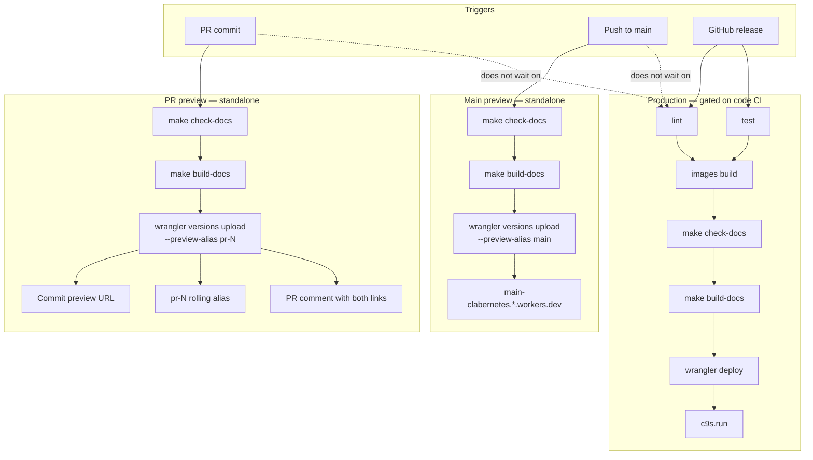

## Why

The c9s documentation site can be built and served locally, but public readers still rely on an external containerlab.dev redirect at `c9s.run`. Hosting the prerendered documentation on Cloudflare Workers with automated previews and release-gated production deployment will give contributors fast, reviewable preview URLs and give users authoritative docs at `c9s.run` aligned with project releases.

## What Changes

- Configure the existing Cloudflare Worker `clabernetes` via `wrangler.toml` for the prerendered output in `docs-site/build/client`, authenticated from GitHub Actions using the repository secrets `CLOUDFLARE_API_TOKEN` and `CLOUDFLARE_ACCOUNT_ID` (already configured).
- Add a **standalone** documentation preview workflow for pull requests that runs `make check-docs` and `make build-docs`, then deploys to Cloudflare **without waiting on** the repository Go lint/test/image pipeline.
- On each pull-request commit, post or update a GitHub comment with **two preview links**:
  - a **commit preview URL** tied to the specific built commit (immutable snapshot), and
  - a **PR preview URL** (rolling alias `pr-<number>`) that always serves the latest documentation built for that pull request.
- Add a **main-branch preview** workflow that deploys documentation from `main` to a stable `main` Workers preview alias (for example `main-clabernetes.<account>.workers.dev`) and **does not** update production at `c9s.run`.
- Extend the existing release workflow so production documentation deploys to `c9s.run` **only after** the release code validation and image build jobs succeed, ensuring docs are not published for a broken release.
- Document Cloudflare custom-domain setup and removal of the current `c9s.run` redirect to containerlab.dev (GitHub secrets `CLOUDFLARE_API_TOKEN` and `CLOUDFLARE_ACCOUNT_ID` are already configured).

## Deployment behavior summary

| Trigger | Docs validation | Waits on code CI? | Cloudflare target | PR comment |
| --------- | ----------------- | ------------------- | ------------------- | ------------ |
| PR commit | `make check-docs` → `make build-docs` | No | commit URL + `pr-<number>` alias preview | Yes — two links |
| Push to `main` | `make check-docs` → `make build-docs` | No | `main` preview alias | No |
| GitHub release | `make check-docs` → `make build-docs` | Yes — after lint, test, and image build | Production `c9s.run` | No |

## Capabilities

### New Capabilities

- `documentation-hosting`: Cloudflare Workers deployment, independent pull-request and main-branch previews, dual-link PR comments, release-gated production publishing, and custom-domain serving for the c9s documentation site.

### Modified Capabilities

- `documentation-site`: Extend requirements to cover hosted deployment workflows, preview URL semantics, and validation gates that must pass before preview or production publish.

## Impact

- Adds `wrangler.toml` and Wrangler-related repository configuration for the documentation Worker.
- Adds `.github/workflows/docs-preview.yaml` and `.github/workflows/docs-main-preview.yaml` (or equivalent jobs), plus a documentation deploy job in `.github/workflows/release.yaml` that depends on release code build success.
- Requires Cloudflare account configuration: existing `clabernetes` Worker, `c9s.run` custom domain, and GitHub secrets `CLOUDFLARE_API_TOKEN` and `CLOUDFLARE_ACCOUNT_ID` (already added to the repository).
- Requires manual DNS/domain cutover: remove the redirect from `c9s.run` to containerlab.dev and attach the domain to the Worker.
- Does not change Clabernetes runtime APIs, controllers, container images, Helm charts, or the operator UI.
