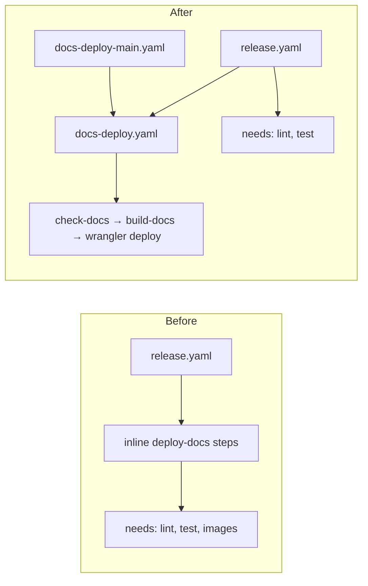
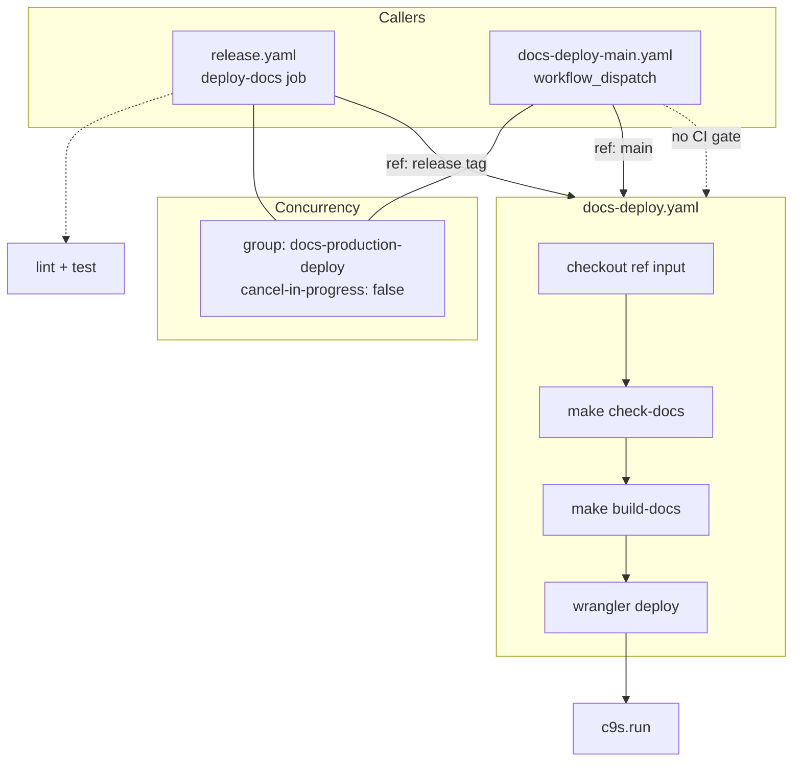
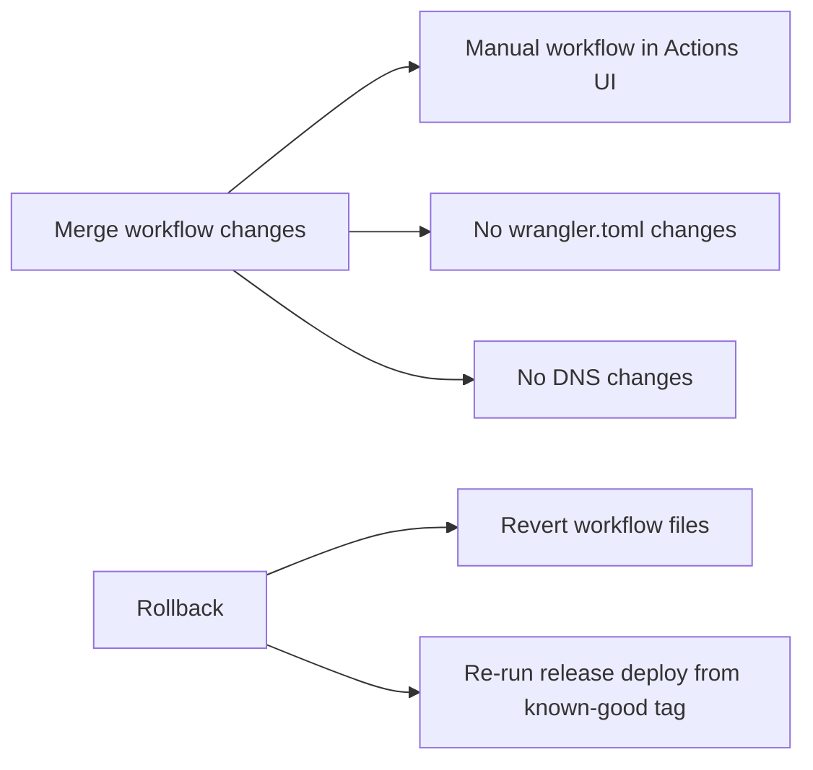

## Context

Production documentation at `c9s.run` is deployed only from `release.yaml` when a GitHub release is created. The `deploy-docs` job runs inline steps (checkout, LFS, pnpm/node setup, `make check-docs`, `make build-docs`, `wrangler deploy`) and currently depends on `lint`, `test`, and `images`. Preview workflows (`docs-preview.yaml`, `docs-main-preview.yaml`) duplicate the build steps but use `wrangler versions upload` for preview aliases instead of production `deploy`.

The repository already uses reusable workflows (`lint.yaml`, `test.yaml`, `images.yaml`) via `workflow_call`. Docs deploy is the outlier.



## Goals / Non-Goals

**Goals:**

- Allow maintainers to publish production docs from `main` via `workflow_dispatch` without cutting a release.
- Extract production docs deploy into a reusable workflow shared by release and manual triggers.
- Remove the unnecessary `images` dependency from release docs deploy.

**Non-Goals:**

- Changing preview workflow behavior (`docs-preview`, `docs-main-preview`).
- Adding ref/sha inputs to the manual workflow (always deploy `main`).
- Deduplicating preview build steps into a shared reusable workflow.
- Automated rollback or version pinning UI for production docs.

## Decisions



### 1. Reusable workflow: `docs-deploy.yaml`

Create `.github/workflows/docs-deploy.yaml` with `workflow_call` inputs:

| Input | Purpose |
|-------|---------|
| `ref` | Git ref to checkout (release tag or `main`) |
| `deploy-message` | Wrangler deploy message |

Steps mirror the current `release.yaml` `deploy-docs` job: checkout with LFS, `git lfs pull`, pnpm 11.17.0, Node 22, `make check-docs`, `make build-docs`, `cloudflare/wrangler-action@v4` with `command: deploy --message "..."`.

Secrets: `CLOUDFLARE_API_TOKEN`, `CLOUDFLARE_ACCOUNT_ID` (inherited via `secrets: inherit`).

**Alternatives considered:**

- Composite action — less visible in Actions UI, doesn't match existing `workflow_call` pattern.
- Duplicate steps in manual workflow only — violates reuse goal and creates drift.

### 2. Manual caller: `docs-deploy-main.yaml`

```yaml
on:
  workflow_dispatch:

concurrency:
  group: docs-production-deploy
  cancel-in-progress: false

jobs:
  deploy:
    uses: ./.github/workflows/docs-deploy.yaml
    with:
      ref: main
      deploy-message: "docs production for main (${{ github.sha }})"
    secrets: inherit
```

`cancel-in-progress: false` queues concurrent production deploys rather than racing.

**Alternatives considered:**

- Optional ref input — more flexible but increases risk of deploying wrong branch; out of scope for now.

### 3. Release workflow refactor

Replace inline `deploy-docs` job in `release.yaml`:

```yaml
deploy-docs:
  needs: [lint, test]          # drop images
  uses: ./.github/workflows/docs-deploy.yaml
  with:
    ref: ${{ github.event.release.tag_name }}
    deploy-message: "docs production for ${{ github.event.release.tag_name }}"
  secrets: inherit
```

Docs deploy no longer blocks on or waits for image builds.

### 4. No lint/test gate on manual deploy

Manual workflow runs only `check-docs` + `build-docs` inside the reusable workflow — same validation gate as preview workflows. Full Go lint/test is unrelated to static docs output.

Release path keeps lint + test gates before docs deploy.

## Risks / Trade-offs

| Risk | Mitigation |
| ------ | ------------ |
| Production docs on `main` ahead of latest release tag | Acceptable for docs-only updates; maintainers understand manual deploy publishes current `main` |
| Later release deploy overwrites newer manual deploy with older tag content | Release tags should normally include recent doc commits; manual deploy can be re-run if needed |
| Broken docs reach production via manual trigger | `make check-docs` gate blocks invalid internal links; same gate as all deploy paths |
| Concurrent release and manual deploy | Shared `docs-production-deploy` concurrency group on both callers prevents cancellation |

## Migration Plan



1. Merge workflow changes — no Cloudflare config changes (`wrangler.toml` unchanged).
2. Manual workflow appears in Actions UI immediately after merge.
3. No DNS or domain changes required.

Rollback: revert workflow files or re-run release deploy from a known-good tag.

## Open Questions

None — scope is well-defined.
