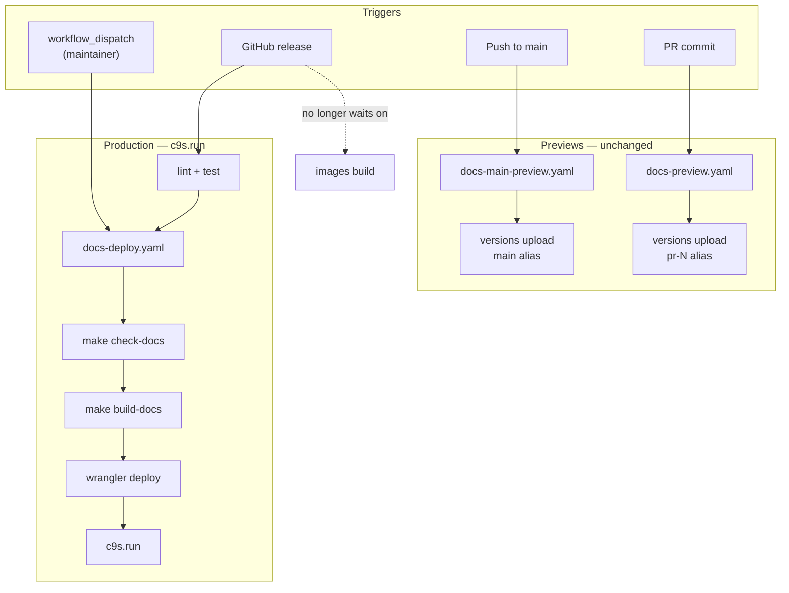

## Why

Production documentation at `c9s.run` is only published when a GitHub release is cut. Docs-only fixes merged to `main` cannot reach production until the next release cycle, leaving readers on outdated content even when preview builds on `main` are current.

## What Changes

- Add a manually triggered GitHub Actions workflow that deploys production documentation from the `main` branch without creating a release.
- Extract the production docs deploy steps into a reusable workflow callable from both the release workflow and the new manual workflow.
- Refactor the release workflow's `deploy-docs` job to call the reusable workflow instead of inline steps.
- Remove the unnecessary dependency on the `images` job for production documentation deployment in the release workflow.

## Deployment paths

| Trigger | Waits on code CI? | Target |
| --------- | ----------------- | -------- |
| `workflow_dispatch` (new) | No | Production `c9s.run` from `main` |
| GitHub release | lint + test only (not images) | Production `c9s.run` from release tag |
| Push to `main` | No | `main` preview alias (unchanged) |
| PR commit | No | `pr-N` preview alias (unchanged) |

## Capabilities

### New Capabilities

- `manual-docs-production-deploy`: Maintainer-triggered production documentation deployment from `main`, independent of the release cycle.

### Modified Capabilities

- `documentation-hosting`: Add a manual production deploy path alongside release-gated production deploy; relax the release workflow's docs deploy dependency on image builds.

## Impact

- `.github/workflows/docs-deploy.yaml` (new reusable workflow)
- `.github/workflows/docs-deploy-main.yaml` (new `workflow_dispatch` caller)
- `.github/workflows/release.yaml` (refactor `deploy-docs` job)
- `openspec/specs/documentation-hosting/spec.md` (delta via change specs)
