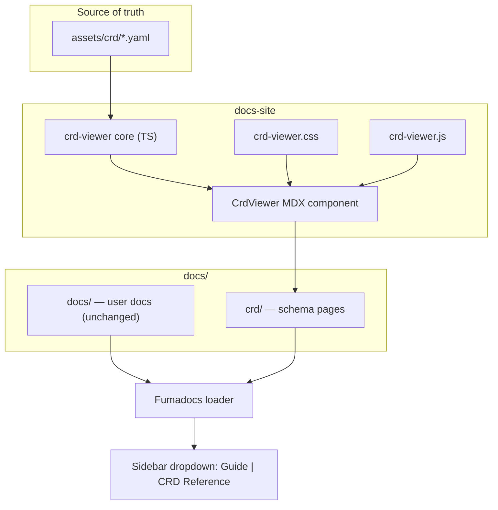
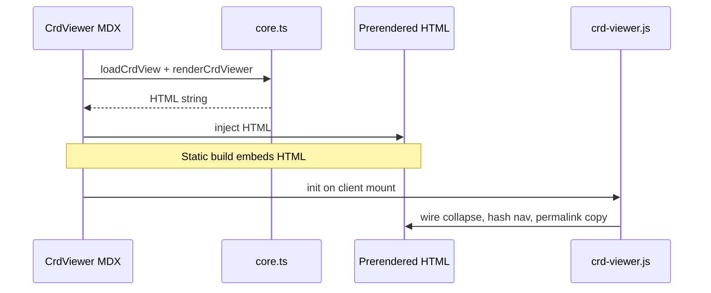
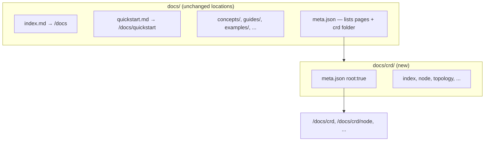

## Context

The c9s docs site (Fumadocs + React Router, `docs-site/`) renders Markdown from `docs/`. CRD schemas are authored once in `assets/crd/*.yaml` (controller-gen) and installed by the manager. The current `docs/crd-reference.md` duplicates schema information in hand-maintained tables that drift from those YAML files.

The team maintains [eda-labs/mkdocs-crd-viewer](https://github.com/eda-labs/mkdocs-crd-viewer), which already implements the desired UX for MkDocs: parse CRD YAML, render collapsible schema trees with field permalinks, and display metadata facts (type, description, enum, default, format, range). This change ports that model into the Fumadocs stack and splits CRD reference into its own documentation category.



## Goals / Non-Goals

**Goals:**

- Render each c9s CRD from `assets/crd/` as an interactive schema reference in the docs site.
- Match mkdocs-crd-viewer behavior: spec/status sections, collapse/expand, hash permalinks with copy-on-click, metadata facts (defaults, enums, formats, ranges).
- Organize docs into two Fumadocs root categories with sidebar dropdown: **Guide** and **CRD Reference**.
- Preserve existing Guide URLs (`/docs`, `/docs/quickstart`, `/docs/concepts/*`, etc.).
- Keep static prerender, browser search, and link validation working for all new routes.
- Port upstream `test_core.py` scenarios as Vitest tests for the TypeScript core.

**Non-Goals:**

- MkDocs plugin or Python in the docs build pipeline.
- Replacing `generated/openapi/openapi.json` or adding Fumadocs OpenAPI REST explorer pages.
- Auto-generating conceptual prose (Node vs Topology relationship stays hand-authored).
- Publishing or syncing to doc.crds.dev.
- Example YAML manifest generation (TeraSky/Backstage feature; not in mkdocs-crd-viewer).

## Decisions

### 1. Port mkdocs-crd-viewer core to TypeScript (not shell out to Python)

**Choice:** Implement `loadCrdView` + `renderCrdViewer` in `docs-site/app/lib/crd-viewer/core.ts`, aligned with eda-labs `core.py`.

**Rationale:** Docs build stays `pnpm-only`; tests run in the same CI as the site; no `uv`/MkDocs dependency for contributors.

**Alternatives considered:**

- **Run Python at build time** — fewer lines to port but splits tooling and CI.
- **Generic JSON Schema viewer (`cf-json-schema-viz`)** — faster bootstrap but lacks CRD chrome, permalink scheme, and metadata facts row without substantial wrapping.

### 2. Reuse vanilla `crd-viewer.js` and `crd-viewer.css` from upstream

**Choice:** Copy `crd-viewer.js` unchanged; adapt CSS token fallbacks from MkDocs Material (`--md-*`) to Fumadocs (`--color-fd-*`).

**Rationale:** The JS encodes hash navigation, ancestor expansion, clipboard-on-`#`, and animated collapse — already battle-tested. The HTML DOM contract from `core.py` must remain identical.

**React component:** `<CrdViewer>` renders build-time HTML via `dangerouslySetInnerHTML` and calls `initCrdViewers(document)` on mount (same as MkDocs asset wiring).



### 3. CRD YAML source path: `assets/crd/` at repo root

**Choice:** MDX passes paths like `../../assets/crd/c9s.run_nodes.yaml`; resolve from repo root at build time.

**Rationale:** Same files as `manager/initcrds.go` and Helm CRDs; single schema source.

**Vite:** `server.fs.allow` already includes parent directories; build-time `fs.readFile` from Node in the component or a small loader helper.

### 4. Sidebar categories without moving guide content

**Choice:** Keep the current flat `docs/` layout for guides, concepts, examples, etc. Add only `docs/crd/` as a new subdirectory. Do **not** create `docs/(guide)/` or relocate existing pages.



**Dropdown (Guide | CRD Reference):**

- **`docs/crd/meta.json`** — `root: true` so inside `/docs/crd/*` the sidebar shows only CRD pages.
- **`DocsLayout` `tabs` prop** — explicit entries so Guide is active on `/docs` and `/docs/quickstart`, etc., without marking the whole tree as a root folder:

```tsx
tabs={[
  { title: 'Guide', description: 'Install, concepts, and operations', url: '/docs' },
  { title: 'CRD Reference', description: 'Custom resource definitions reference', url: '/docs/crd' },
]}
```

**Why not `(guide)`?** Fumadocs auto-tabs from `root: true` folders require each dropdown entry to be a root folder. Wrapping all guide content in `(guide)` works but forces a bulk file move. Explicit `tabs` plus a single `root: true` on `crd/` achieves the same dropdown UX with minimal churn.

**`docs/meta.json`:** Replace `crd-reference` with `crd` in `pages`; remove `crd-reference.md` from the tree.

**Icons:** Lucide on `docs/crd/meta.json` (e.g. `Braces`); Guide tab title/description come from `DocsLayout` `tabs`.

### 5. Per-kind CRD pages instead of one monolithic reference

**Choice:** Six kind pages + overview `index.md` under `docs/crd/`, each with short prose + `<CrdViewer src="..." />`.

**Rationale:** Better permalinks, TOC, and search; aligns with one CRD file per viewer instance (upstream enforces one CRD per YAML file).

**Kinds:** Topology, Node, Link, LauncherProfile, Config, ImageRequest — matching `assets/crd/c9s.run_*.yaml`.

### 6. YAML parsing: `yaml` package with controller-gen quirk handling

**Choice:** Use `yaml` (npm) with custom constructor for `tag:yaml.org,2002:value` (bare `=` defaults), mirroring upstream `CRDLoader`.

**Rationale:** controller-gen emits defaults that break strict PyYAML/JS parsers without this handling.

### 7. Testing strategy

**Choice:** Vitest tests ported from `tests/test_core.py` (version selection, multi-CRD rejection, spec/status rendering, enum facts, scalar arrays, leaf collapsible nodes).

**Optional:** Golden HTML fixture for one real c9s Node CRD snippet.

## Risks / Trade-offs

| Risk | Mitigation |
| ------ | ------------ |
| TS core drifts from eda-labs `core.py` | Shared test scenarios; document upstream sync point in file header |
| `dangerouslySetInnerHTML` + client JS hydration edge cases | Init script on mount; re-init if MDX remounts; manual smoke on hash permalinks |
| Large Topology CRD page weight | Per-kind pages; viewer renders one CRD per page; prerender still static HTML |
| Fumadocs TOC vs viewer internal anchors | CRD permalinks use `#crd-viewer-*` ids; separate from page heading TOC |
| Link checker misses new routes | Extend `check-links.ts` / prerender glob covers `docs/crd/**` |
| Dark mode styling | Map `--crd-*` tokens to `--color-fd-*`; test both themes |

## Migration Plan

1. Land viewer library + `<CrdViewer>` + CSS/JS without moving docs (spike on one page).
2. Add `docs/crd/` with root `meta.json` and `DocsLayout` tabs; update `docs/meta.json` (no guide file moves).
3. Add per-kind CRD MDX pages; delete hand-maintained tables from old `crd-reference.md`.
4. Update internal links pointing to CRD sections (heading anchors → kind pages or viewer field hashes).
5. Run `pnpm check` (typecheck, link check, build) before merge.

**Rollback:** Revert `docs/crd/`, tabs config, and viewer package; restore `crd-reference.md` from git history if needed.

## Open Questions

- Whether Topology viewer page should use `showStatus={false}` to reduce status subtree size (can default `true` and tune per page).
- Whether to add a `tabs.transform` on `DocsLayout` for custom icons beyond Lucide names in `meta.json` (optional polish).
